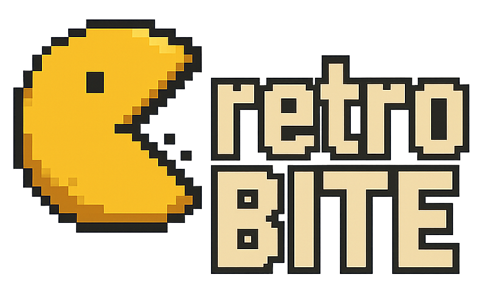

  
  <h2 align="center">Retro Image File Server</h2>
  
A Docker-based network file server for hosting and streaming retro game images over your local network.

## Features

- **SMB/CIFS** with SMBv1 compatibility for older consoles
- **FTP Server** with anonymous access and passive mode
- and more coming

## Project Background
This project was created to provide a dockerized container for streaming game files over local network to various retro consoles. While other solutions existed, none offered the combination of features and Docker support I needed. retroBite is an experimental project that aims to simplify retro gaming over local network.

## Consoles

Please read the [`CONSOLES.md`](CONSOLES.md) file for supported consoles, their protocols, and how to connect each of them.

## Environment Variables

| Variable | Default | Description |
|----------|---------|-------------|
| `USER` | `retro` | SMB and FTP username |
| `PASS` | `retro123` | SMB and FTP password |
| `HOST_IP` | (auto) | Host IP for FTP passive mode |

## Built With

- **Samba** - SMB/CIFS file sharing
- **vsftpd** - FTP server
- **Ubuntu 22.04** - Base image

## Add Cover Art
- [OPL Manager](https://oplmanager.com/site/) GUI (Winows)
- [OPL PC Tools](https://github.com/brainstream/OPL-PC-Tools) GUI (Winows/Linux)
- [PS2 Game Manager](https://github.com/dheison0/ps2-game-manager) CLI (Go)

## Big thanks to 

- [libretro](https://github.com/libretro/retroarch-assets/tree/master/xmb/retrosystem/png) for reto console assets