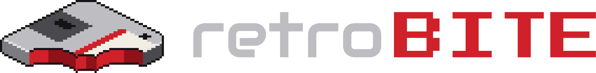

<p align="center">
  <a href="https://github.com/retroBITE-app/retroBITE/">
    
  </a>
  <p align="center">A clean, self-hosted collection manager for retro games. <br>Pair your ROMs with rich metadata and artwork, then serve your library over the local network directly to your devices.</p>
</p>

<p align="center">
  <a href="https://github.com/retroBITE-app/retroBITE/stargazers" target="_new">
    
  </a>
  <a href="https://github.com/retroBITE-app/retroBITE/network/members" target="_new">
    
  </a>
  <br>
  <a href="https://hub.docker.com/r/retrobite/retrobite/tags" target="_new">
    
  </a>
  <a href="https://github.com/retroBITE-app/retroBITE/actions/workflows/tests.yml" target="_new">
    
  </a>
  <br>
  <a href="https://github.com/retroBITE-app/retroBITE/releases" target="_new">
    
  </a>
  <a href="https://hub.docker.com/r/retrobite/retrobite" target="_new">
    
  </a>
  <a href="https://hub.docker.com/r/retrobite/share" target="_new">
    
  </a>
</p>

## Features

- **Serve your library to consoles** over SMB (with SMBv1 for older consoles)
  and FTP with passive mode, confined to the library.
- **Browse and manage it on the web**: every console on its own shelf, with
  uploads, folders and the layout your loader expects — keep your own
  arrangement, or use game folders for disc consoles, RetroArch or Open PS2
  Loader.
- **Metadata and artwork from ScreenScraper**: titles, descriptions, covers,
  screenshots and more, matched by hash or by name.
- **RetroAchievements**: see which games have a set and how far you are.
- **Tools → Conversion**: shrink and convert disc images — CHD, CSO/ZSO, ECM,
  VCD for POPStarter, RVZ and WBFS for GameCube and Wii — in a queue, one game
  or a hundred at a time.
- **Send to** a USB drive or a network share, laid out for Batocera or Open PS2
  Loader, covers and all.

## Disclaimer

retroBITE is intended for use with backups you have legally made from media you
own. We do not endorse or condone piracy in any form. Only use this software
with ROMs you have the legal right to possess.

## Project Background

retroBITE was born out of necessity. What started as a hunt for a Docker setup
to network-load games onto personal consoles quickly grew when available
projects fell short. It naturally evolved from a simple server script into a
full collection management hub.

## Getting started

retroBITE runs only in Docker. We do not support installing it any other way.

### With the Docker Hub images

You need Docker with Compose 2.24 or newer, on Linux, a NAS or Docker Desktop.

1. **Get the compose file and the settings**, from the latest release:

   ```bash
   mkdir retrobite && cd retrobite
   curl -LO https://github.com/retroBITE-app/retroBITE/releases/latest/download/docker-compose.yml
   curl -L -o .env https://github.com/retroBITE-app/retroBITE/releases/latest/download/.env.example
   ```

   While retroBITE is in beta there is no full release yet, so `latest` finds
   nothing. Take the files from the newest pre-release on the
   [releases page](https://github.com/retroBITE-app/retroBITE/releases)
   instead, such as `releases/download/20261006-BETA/docker-compose.yml`.

2. **Edit `.env`.** It holds only what is worth changing:

   | Setting | What it is |
   | --- | --- |
   | `AUTH_USER` / `AUTH_PASS` | The account consoles use for SMB and FTP. **Change the password.** |
   | `DB_PASSWORD` / `DB_ROOT_PASSWORD` | The database's passwords. Change them before the first start: they are set when the database is created. |
   | `GAMES_PATH` | Where your library is on this machine. Defaults to `./games`. |
   | `HOST_IP` | This machine's LAN address: the address consoles connect to. |
   | `APP_TIMEZONE` | Your time zone, such as `Europe/Stockholm`. |

   Every other setting is in [docs/configuration.md](docs/configuration.md).
   There is no key to generate: retroBITE makes its own on the first start.

3. **Start it.**

   ```bash
   docker compose up -d
   ```

4. **Open http://localhost:81** and follow the four-step setup.

**Using Portainer, Dockhand, Synology, QNAP, Unraid or TrueNAS?**
[docs/installing.md](docs/installing.md) has steps for each. It also covers a
NAS whose own file sharing already uses the SMB and FTP ports, updating, and
backups.

The compose file runs the version it came with. To follow every release, set
`RETROBITE_TAG=latest` (or `develop` for pre-releases); then
`docker compose pull && docker compose up -d` updates it.

## Where your data lives

| Where | What |
| --- | --- |
| `GAMES_PATH` (default `./games`) | Your ROM library, one folder per console. Shared as `/games` over SMB and FTP. |
| `retrobite-db` volume | The MariaDB database: your games, their metadata, your settings. |
| `retrobite-state` volume | The application key. Back it up with the database: stored passwords cannot be read without it. |
| `retrobite-media` volume | The artwork and media retroBITE downloads. |
| `./docs` | The markdown knowledge base. |

Each can be a folder of your own instead: see `DB_PATH`, `STATE_PATH`,
`MEDIA_PATH` and `DOCS_PATH` in [docs/configuration.md](docs/configuration.md).
They survive `docker compose down` and updates. ROMs are never served straight
over the web: downloads go through a signed-in route only.

## Built With

- **Samba** and **vsftpd** — SMB and FTP
- **Debian 12 (bookworm-slim)** — the share container
- **PHP 8.5 + Laravel 13** — the web interface
- **Livewire 4 + Flux** and **Tailwind CSS 4** — its frontend, built with Vite
- **MariaDB 11.4** — the database

## Contributing

Pull requests are welcome. Read [CONTRIBUTING.md](CONTRIBUTING.md) first: it
covers the development setup, the tests, the code style, commit messages and
how releases are published.

## Credits

- [Libretro](https://github.com/libretro/retroarch-assets/tree/master/xmb/retrosystem/png): Sourced console iconography.
- AI/LLM Tools: Assisted in the creation of original project assets.
- Our Contributors: Made with ❤️ by the community.
